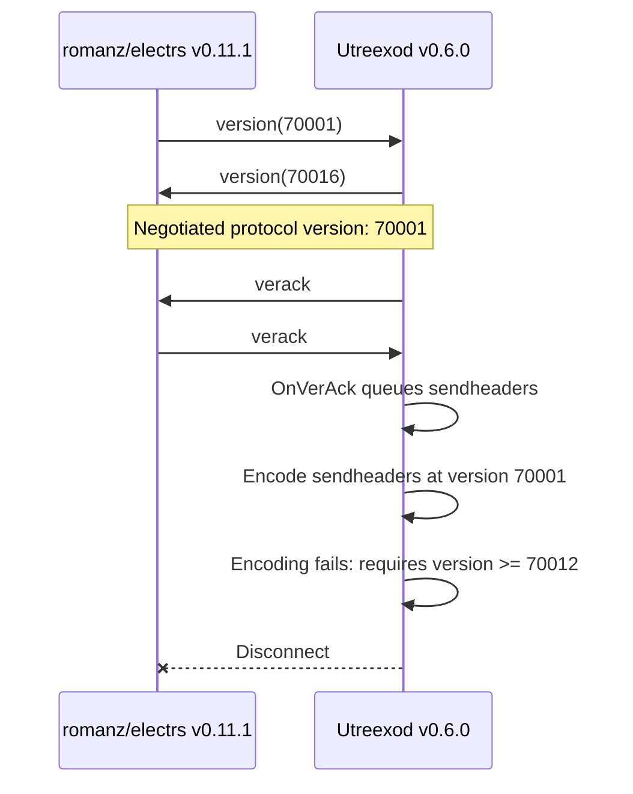
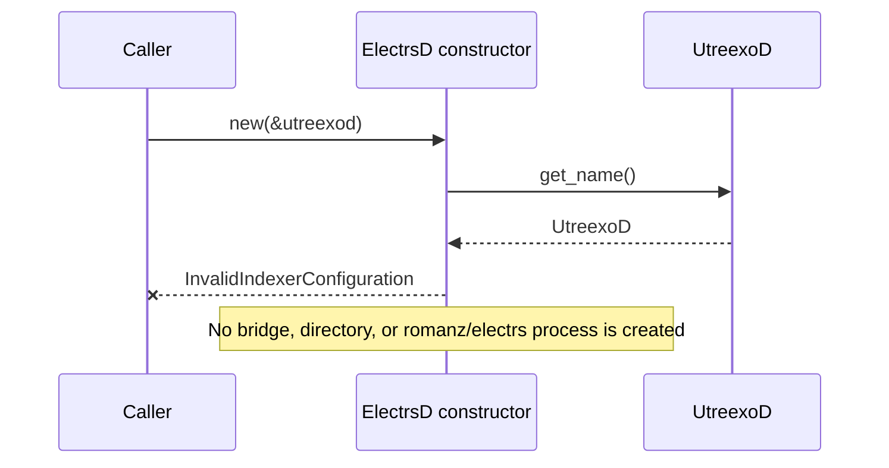
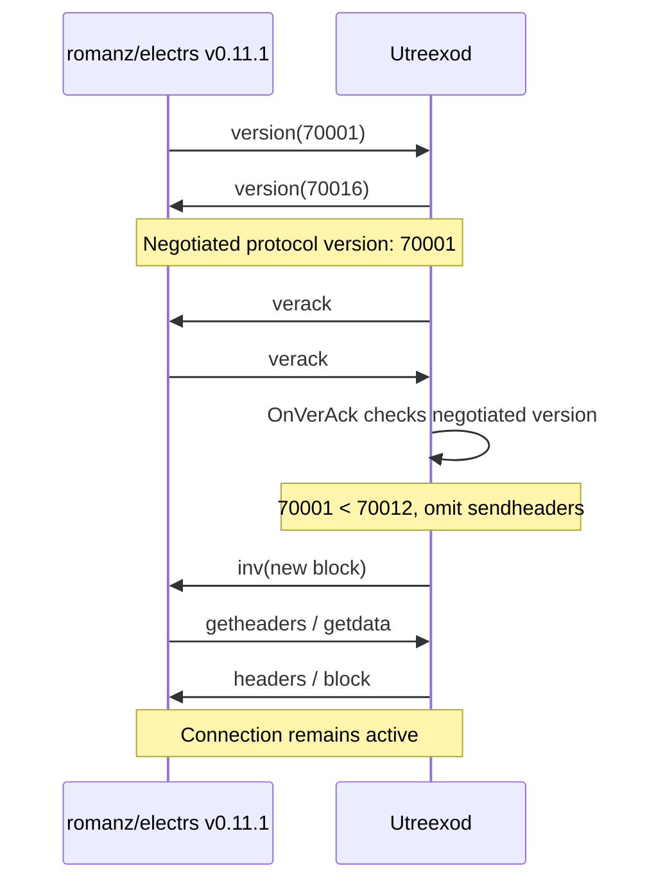

# Utreexod disconnects pre-`sendheaders` peers after `verack`

## Summary

Utreexod v0.6.0 disconnects a peer that advertises a Bitcoin P2P protocol
version below `70012`. The peer is initially accepted, but after receiving its
`verack`, Utreexod unconditionally queues a `sendheaders` message. Utreexod's
wire encoder correctly rejects that message at negotiated protocol versions
below `70012`, and the resulting write error disconnects the peer.

This affects `romanz/electrs` v0.11.1, which advertises protocol version `70001`.
`romanz/electrs` otherwise supports the messages it needs to synchronize through the
legacy `inv`, `getheaders`, `headers`, `getdata`, and `block` flow.

Affected versions:

- Utreexod v0.6.0
- `romanz/electrs` v0.11.1

`halfin` currently rejects this pairing before creating an indexer data
directory or spawning `romanz/electrs`. ElectrumX also currently rejects UtreexoD, for
separate Bitcoin Core RPC-compatibility reasons.

## Relevant implementation

- [`serverPeer.OnVerAck` queues `sendheaders` unconditionally](https://github.com/utreexo/utreexod/blob/fe71f3d9282ef0812f7f6087f0c0df9ce0fda508/server.go#L578-L586).
- [`MsgSendHeaders.BtcEncode` rejects negotiated versions below `70012`](https://github.com/utreexo/utreexod/blob/fe71f3d9282ef0812f7f6087f0c0df9ce0fda508/wire/msgsendheaders.go#L32-L41).
- [The peer output handler disconnects after a write error](https://github.com/utreexo/utreexod/blob/fe71f3d9282ef0812f7f6087f0c0df9ce0fda508/peer/peer.go#L1948-L1981).
- [`romanz/electrs` builds its version message using rust-bitcoin's protocol version](https://github.com/romanz/electrs/blob/35216c6d30148be8e6763d913d437330f431fc03/src/p2p.rs#L318-L338), which is [`70001` in rust-bitcoin 0.32.8](https://github.com/rust-bitcoin/rust-bitcoin/blob/bitcoin-0.32.8/bitcoin/src/p2p/mod.rs#L57).

## Current direct flow

The negotiated version is `min(70001, 70016) = 70001`. Utreexod accepts that
version, but later attempts to encode a message that is invalid at the
negotiated version.



## Current halfin flow



## Expected flow

Utreexod should send `sendheaders` only when the negotiated protocol version
is at least `wire.SendHeadersVersion`. Older peers should remain connected and
continue using inventory announcements.



## Proposed fix

Guard the message in `serverPeer.OnVerAck`:

```go
if sp.ProtocolVersion() >= wire.SendHeadersVersion {
	sp.QueueMessage(wire.NewMsgSendHeaders(), nil)
}
```

The existing behavior should remain unchanged for peers negotiating version
`70012` or newer.

## Acceptance criteria

- A peer advertising version `70001` completes the version handshake and
  remains connected after `verack`.
- Utreexod does not queue or encode `sendheaders` for that peer.
- The peer can synchronize headers and blocks through legacy inventory
  announcements.
- A peer negotiating version `70012` or newer still receives `sendheaders`.
- Tests cover both sides of the protocol-version boundary.

Once the fix is available in the Utreexod binary used by `halfin`, the
temporary `romanz/electrs` backend rejection can be removed.
